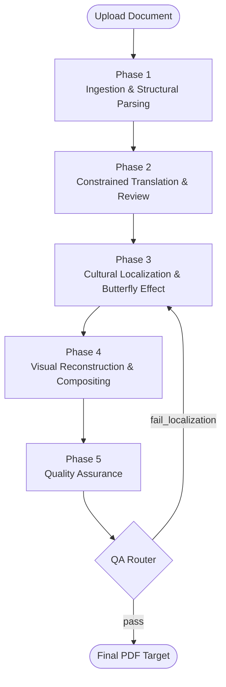

# OmniLocal: Agentic Framework for Cross-Cultural Content Adaptation


**Team APCS 24A01 — GDGoC 2026**

OmniLocal is a fully asynchronous multi-agent system designed to automate the translation, cultural localization, and visual rendering of complex document layouts. The system heavily relies on state-machine architecture to coordinate parallel computation across isolated environments.

---

## 1. Core Architecture

OmniLocal uses a decentralized **Orchestrator–Worker** architecture. The Orchestrator is a lightweight State Machine (managed by LangGraph) that handles data flow between 5 strictly isolated Partner Microservices (Workers).

### System Phases


- **LangGraph Checkpointing**: Checkpointing state limitations are resolved by implementing `AsyncSqliteSaver`, allowing the core graph to naturally suspend and resume Multi-Agent threads asynchronously.
- **Webhook & Callback Mechanism**: To prevent blocked HTTP connections, Phase Workers process algorithms recursively in the background and sequentially POST results back via the webhook namespace (`/webhook/phaseX`).

---

## 2. Quick Start Guide

The environment runs on script-based automation targeting local prototyping. Docker encapsulation handles formal deployment.

### System Initialization
Execute the following inside the repository root to build necessary internal dependency environments:
```powershell
.\install_all.ps1
```
*This script will compile all Python virtual environments and Node modules automatically.*

### Local Execution
To concurrently boot all node gateways and servers:
```powershell
.\start_all.ps1
```
The Frontend client operates statically at `http://localhost:3000`. The Orchestrator acts as the unified middleware at `http://localhost:8000`.

---

## 3. Development Protocol

Project contributors must strictly adhere to the following encapsulated methodology:

1. **Write Logic:** Core algorithmic logic must only reside inside `app/worker.py` within your appointed Phase block.
2. **Handle Dependencies:** Do not mutate `pip` directly. All sub-system external packages must be appended to the local Phase `requirements.txt`. Reset sequences using `.\install_all.ps1` to re-synchronize environments safely.
3. **Data Contracting:** Output pipelines from your algorithms must implicitly match schemas assigned in `docs/API_CONTRACT.md` before resolving the Webhook.

---

## 4. Source Directory

- `docs/` - System architecture blueprints, Phase specs, and Contracts.
- `orchestrator/` - The LangGraph state machine and FastAPI unified gateway.
- `frontend/` - The Vite + React single-page application.
- `phase0/` to `phase5/` - Delegated partner microservices.

---

## 5. License

Copyright © 2026 Team APCS 24A01 — GDGoC 2026.

Permission is hereby granted, free of charge, to any person obtaining a copy of this software and associated documentation files (the "Software"), to deal in the Software without restriction, including without limitation the rights to use, copy, modify, merge, publish, distribute, sublicense, and/or sell copies of the Software.

*Licensed under the MIT License.*
