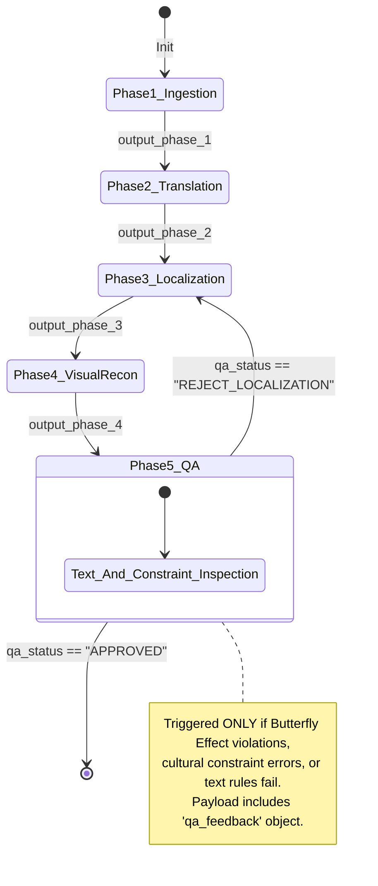

# OmniLocal – API Contract

This document defines the strict JSON payload schema exchanged between the **Orchestrator** and the microservices (**Phase 1 to Phase 5**). To ensure architectural integrity, the output payload of `Phase N` becomes the core input payload of `Phase N+1`.

---

## 1. Execution Flow & Conditional Edges (LangGraph)



---

## 2. API JSON Contract per Phase

*Developers: Please refine the arrays and objects below by inserting your specific data schemas. Assume linear execution (no loops) for your baseline IO.*

### [Phase 1: Ingestion & Structural]
**Source:** Triggered by Client/Orchestrator.
- **Input Received:**
  ```json
  {
      "thread_id": "uuid-string-of-current-run",
      "webhook_url": "http://localhost:8000/webhook/phase1",
      "global_metadata": {
          "cultural_context": "Vietnam",
          "target_language": "vi"
      },
      "source_pdf_path": "data/uploads/source.pdf",
      "brief_path": "data/uploads/brief.txt"
  }
  ```
- **Output Required (Sent to Webhook):**
  ```json
  {
      "output_phase_1": [
          {
              "page_id": 1,
              "width": 612.0,
              "height": 792.0,
              "text_blocks": [
                  {
                      "content": "string",
                      "bbox": [0.0, 0.0, 0.0, 0.0],
                      "font": "string",
                      "size": 0.0,
                      "color": 0,
                      "flags": 0,
                      "editability_tag": "editable | non-editable"
                  }
              ],
              "image_blocks": []
          }
      ]
  }
  ```

### [Phase 2: Context-Aware Translation]
**Source:** Receives data processed by Phase 1.
- **Input Received:**
  ```json
  {
      "thread_id": "uuid-string-of-current-run",
      "webhook_url": "http://localhost:8000/webhook/phase2",
      "global_metadata": { ... },
      "output_phase_1": [ ... ]
  }
  ```
- **Output Required (Sent to Webhook):**
  ```json
  {
     "output_phase_2": [
          {
              "original_content": "string",
              "translated_content": "string",
              "bbox": [0.0, 0.0, 0.0, 0.0],
              "page_id": 1,
              "source_type": "text | ocr",
              "font": "string",
              "size": 0.0,
              "color": 0,
              "flags": 0,
              "warning": "string | null"
          }
      ]
  }
  ```

### [Phase 3: Localization & Butterfly Effect]
**Source:** Receives data processed by Phase 2.
- **Input Received:**
  ```json
  {
      "thread_id": "uuid-string-of-current-run",
      "webhook_url": "http://localhost:8000/webhook/phase3",
      "global_metadata": { ... },
      "output_phase_2": [ ... ]
  }
  ```
- **Output Required (Sent to Webhook):**
  ```json
  {
      "output_phase_3": [
          // TUAN ANH: Define Phase 3's exact Output JSON fields/arrays here
      ],
      "translation_warnings": []
  }
  ```

### [Phase 4: Visual Reconstruction]
**Source:** Receives data processed by Phase 3.
- **Input Received:**
  ```json
  {
      "thread_id": "uuid-string-of-current-run",
      "webhook_url": "http://localhost:8000/webhook/phase4",
      "global_metadata": { ... },
      "output_phase_3": [ ... ]
  }
  ```
- **Output Required (Sent to Webhook):**
  ```json
  {
      "output_phase_4": {
          // KIET: Add any image processing logs/paths if needed
          "composited_pdf_path": "data/output/rendered_file.pdf"
      }
  }
  ```

### [Phase 5: Quality Assurance]
**Source:** Receives data processed by Phase 4.
- **Input Received:**
  ```json
  {
      "thread_id": "uuid-string-of-current-run",
      "webhook_url": "http://localhost:8000/webhook/phase5",
      "global_metadata": { ... },
      "source_pdf_path": "data/uploads/source.pdf",
      "output_phase_4": { ... }
  }
  ```
- **Output Required (Sent to Webhook):**
  ```json
  {
      "qa_status": "APPROVED", // Or "REJECT_LOCALIZATION"
      "qa_feedback": {
          // TUAN ANH: Define the error context array/object to feed back to Phase 3 here
      },
      "final_pdf_path": "data/output/final_approved.pdf"
  }
  ```
