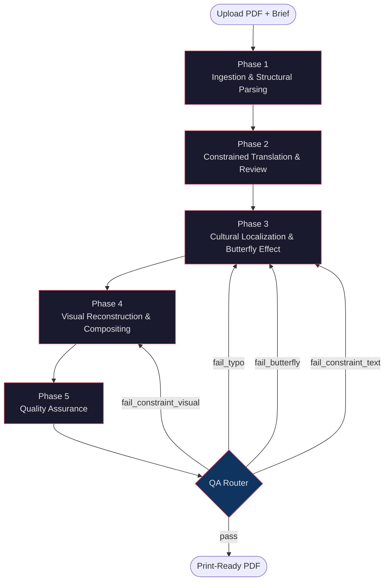
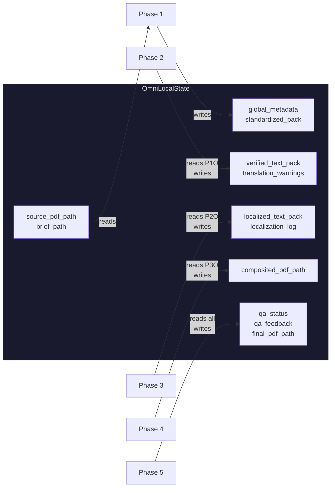
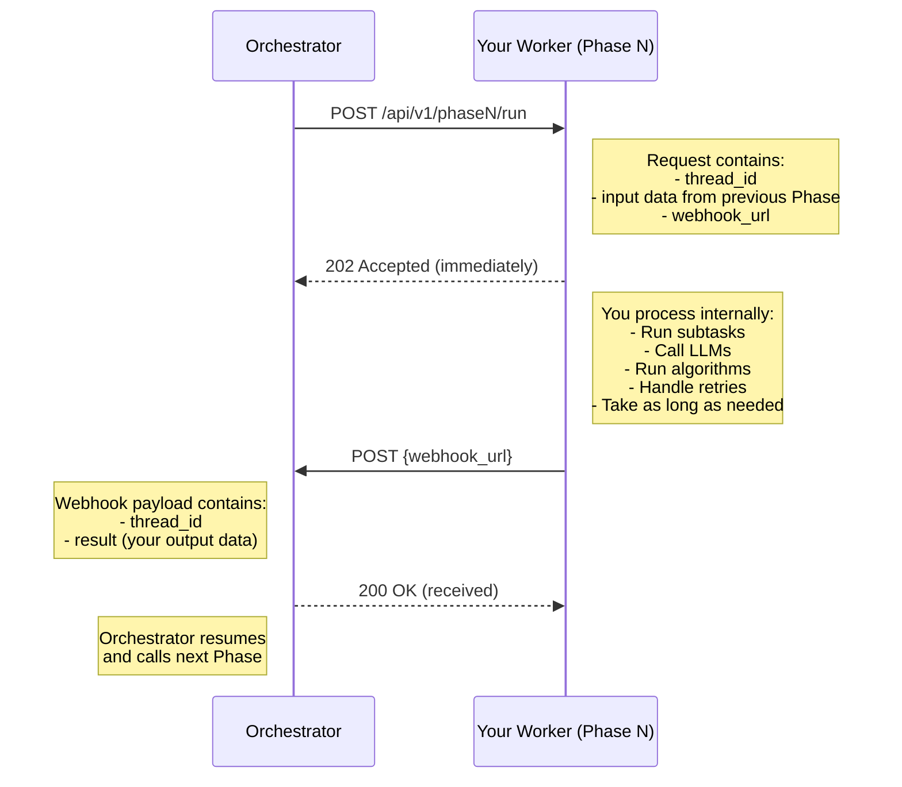
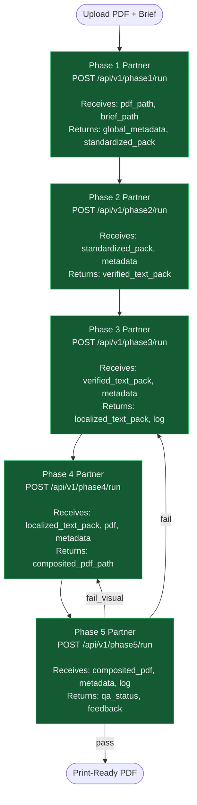

# OmniLocal — LangGraph Orchestrator Blueprint

> **Project:** OmniLocal — Agentic Framework for Cross-Cultural Multimodal Content Adaptation  
> **Team:** APCS 24A01 · GDGoC 2026  
> **Copyright:** © 2026 Team APCS 24A01 — GDGoC 2026. All rights reserved.  
> **Version:** v3.0 · April 2026

---

## Table of Contents

1. [Architecture Overview](#1-architecture-overview)
2. [Key Terminology](#2-key-terminology)
3. [LangGraph State Machine](#3-langgraph-state-machine)
4. [OmniLocalState Schema](#4-omnilocalstate-schema)
5. [Orchestrator Implementation](#5-orchestrator-implementation)
6. [Critical Guide for Partners](#6-critical-guide-for-partners)
7. [Partner API Contracts](#7-partner-api-contracts)
8. [Tech Stack](#8-tech-stack)
9. [Rules & Conventions](#9-rules--conventions)

---

## 1. Architecture Overview

OmniLocal follows an **Orchestrator–Worker** architecture. The Orchestrator is a lightweight state machine that manages Phase transitions. Each Phase is owned by a Partner who builds an independent service (Worker) to handle all domain-specific logic.

```
┌────────────────────────────────────────────────────────────────┐
│              LANGGRAPH ORCHESTRATOR  (~150 lines of code)      │
│                                                                │
│   Knows ONLY 5 Phases + 1 QA Router                           │
│   Does NOT know internal subtasks, parallelism, or algorithms  │
│                                                                │
│   Phase1 ──▶ Phase2 ──▶ Phase3 ──▶ Phase4 ──▶ Phase5 ──▶ QA   │
└────┬───────────┬───────────┬───────────┬───────────┬───────────┘
     │ dispatch  │ dispatch  │ dispatch  │ dispatch  │ dispatch
     ▼           ▼           ▼           ▼           ▼
┌─────────┐ ┌─────────┐ ┌─────────┐ ┌─────────┐ ┌─────────┐
│ Worker 1 │ │ Worker 2 │ │ Worker 3 │ │ Worker 4 │ │ Worker 5 │
│ (Partner)│ │ (Partner)│ │ (Partner)│ │ (Partner)│ │ (Partner)│
│          │ │          │ │          │ │          │ │          │
│ Owns all │ │ Owns all │ │ Owns all │ │ Owns all │ │ Owns all │
│ internal │ │ internal │ │ internal │ │ internal │ │ internal │
│ logic    │ │ logic    │ │ logic    │ │ logic    │ │ logic    │
└──────────┘ └──────────┘ └──────────┘ └──────────┘ └──────────┘
```

### Separation of Concerns

| Role | Responsibility | Does NOT |
|------|---------------|----------|
| **Orchestrator** | Dispatch jobs to Workers, manage state transitions, route QA feedback | Know internal subtasks, decide parallelism, call LLMs directly |
| **Worker (Partner)** | Execute all domain logic for one Phase, decide internal architecture | Know about other Phases, call other Workers directly |

---

## 2. Key Terminology

| Term | Definition | Who Owns It |
|------|-----------|-------------|
| **LangGraph** | A stateful graph framework that defines the execution order of Phases. It holds the `OmniLocalState` and decides which Phase to call next. | Orchestrator |
| **Node** | A single step in the LangGraph. In OmniLocal, each Node = one Phase. The Node dispatches a job and waits for results. | Orchestrator |
| **OmniLocalState** | A shared dictionary that holds all inputs and outputs between Phases. It is the single source of truth for the entire pipeline. | Orchestrator |
| **Worker** | A Partner-owned microservice (FastAPI + Docker) that receives a job, performs heavy computation, and returns results. | Partner |
| **Webhook** | An HTTP callback fired by the Worker back to the Orchestrator when processing is complete. This resumes the suspended LangGraph Node. | Partner fires it, Orchestrator receives it |
| **QA Router** | The only conditional edge in the graph. It reads `qa_status` from Phase 5 and routes back to Phase 3 or Phase 4 if issues are found. | Orchestrator |

---

## 3. LangGraph State Machine

### Pipeline Flow



### Graph Specification

The entire LangGraph consists of **6 Nodes** and **1 Conditional Edge**:

| Node | Action | Calls |
|------|--------|-------|
| `phase1` | Dispatch job to Worker 1, wait for webhook | `POST /api/v1/phase1/run` |
| `phase2` | Dispatch job to Worker 2, wait for webhook | `POST /api/v1/phase2/run` |
| `phase3` | Dispatch job to Worker 3, wait for webhook | `POST /api/v1/phase3/run` |
| `phase4` | Dispatch job to Worker 4, wait for webhook | `POST /api/v1/phase4/run` |
| `phase5` | Dispatch job to Worker 5, wait for webhook | `POST /api/v1/phase5/run` |
| `qa_router` | Read `qa_status` → route to Phase 3, Phase 4, or END | — |

**Edges:**
- 5 linear edges: `phase1 → phase2 → phase3 → phase4 → phase5`
- 1 conditional edge: `phase5 → qa_router → { END, phase3, phase4 }`

### Data Flow Between Phases



---

## 4. OmniLocalState Schema

The state only contains **inter-Phase I/O** — not internal Partner state.

```python
from typing import TypedDict, Optional


class OmniLocalState(TypedDict):
    """
    Central pipeline state. Each Phase reads its inputs and writes its outputs.
    The Orchestrator manages this state; Partners never modify it directly.
    """

    # ── Pipeline Control ───────────────────────────────────────
    thread_id: str                  # Unique pipeline run ID
    current_phase: int              # Active phase (1–5)
    status: str                     # IDLE | PROCESSING | COMPLETED | FAILED
    pipeline_iteration: int         # QA feedback cycle count (max 2)

    # ── Initial Inputs ─────────────────────────────────────────
    source_pdf_path: str            # Path to uploaded source PDF
    brief_path: str                 # Path to project brief (DOCX/XLSX)

    # ── Phase 1 Output → Phase 2 Input ─────────────────────────
    global_metadata: dict           # Copyright constraints, style, protected names
    standardized_pack: list[dict]   # Per-page: text_blocks, image_blocks, editability tags

    # ── Phase 2 Output → Phase 3 Input ─────────────────────────
    verified_text_pack: list[dict]  # Translated + reviewed text with bbox preserved
    translation_warnings: list[dict]  # Chunks flagged after circuit break

    # ── Phase 3 Output → Phase 4 Input ─────────────────────────
    localized_text_pack: list[dict] # Context-safe localized text with bbox
    localization_log: list[dict]    # Audit trail of all entity changes

    # ── Phase 4 Output → Phase 5 Input ─────────────────────────
    composited_pdf_path: str        # Path to composited PDF

    # ── Phase 5 Output ─────────────────────────────────────────
    qa_status: str                  # pass | fail_typo | fail_butterfly | fail_constraint_*
    qa_feedback: Optional[dict]     # Feedback details for cross-phase correction
    final_pdf_path: str             # Print-ready PDF path (only when qa_status == "pass")
```

---

## 5. Orchestrator Implementation

### graph.py

```python
from langgraph.graph import StateGraph, END
from orchestrator.state import OmniLocalState
from orchestrator.nodes import call_phase1, call_phase2, call_phase3, call_phase4, call_phase5
from orchestrator.routers import qa_router


def build_graph() -> StateGraph:
    """Build the OmniLocal LangGraph. 5 linear edges + 1 conditional edge."""
    graph = StateGraph(OmniLocalState)

    graph.add_node("phase1", call_phase1)
    graph.add_node("phase2", call_phase2)
    graph.add_node("phase3", call_phase3)
    graph.add_node("phase4", call_phase4)
    graph.add_node("phase5", call_phase5)

    graph.set_entry_point("phase1")
    graph.add_edge("phase1", "phase2")
    graph.add_edge("phase2", "phase3")
    graph.add_edge("phase3", "phase4")
    graph.add_edge("phase4", "phase5")

    graph.add_conditional_edges("phase5", qa_router, {
        "pass":                   END,
        "fail_typo":              "phase3",
        "fail_butterfly":         "phase3",
        "fail_constraint_text":   "phase3",
        "fail_constraint_visual": "phase4",
    })

    return graph.compile()
```

### nodes.py

Each node follows the same pattern: **dispatch job → suspend → resume on webhook → update state**.

```python
import httpx
from langgraph.types import interrupt
from orchestrator.state import OmniLocalState
from orchestrator.config import PHASE_URLS, WEBHOOK_BASE_URL


async def call_phase1(state: OmniLocalState) -> dict:
    """
    Dispatch Phase 1 job to the Partner Worker.
    The Worker processes internally and fires a webhook when done.
    """
    # Step 1: Dispatch job to Worker
    async with httpx.AsyncClient(timeout=30) as client:
        await client.post(f"{PHASE_URLS[1]}/api/v1/phase1/run", json={
            "thread_id": state["thread_id"],
            "source_pdf_path": state["source_pdf_path"],
            "brief_path": state["brief_path"],
            "webhook_url": f"{WEBHOOK_BASE_URL}/webhook/phase1",
        })

    # Step 2: Suspend — graph sleeps until Worker fires webhook
    result = interrupt({"waiting_for": "worker_phase1"})

    # Step 3: Resume — webhook payload arrives as `result`
    return {
        "global_metadata": result["global_metadata"],
        "standardized_pack": result["standardized_pack"],
        "current_phase": 1,
        "status": "COMPLETED",
    }


async def call_phase2(state: OmniLocalState) -> dict:
    async with httpx.AsyncClient(timeout=30) as client:
        await client.post(f"{PHASE_URLS[2]}/api/v1/phase2/run", json={
            "thread_id": state["thread_id"],
            "standardized_pack": state["standardized_pack"],
            "global_metadata": state["global_metadata"],
            "webhook_url": f"{WEBHOOK_BASE_URL}/webhook/phase2",
        })

    result = interrupt({"waiting_for": "worker_phase2"})

    return {
        "verified_text_pack": result["verified_text_pack"],
        "translation_warnings": result.get("translation_warnings", []),
        "current_phase": 2,
        "status": "COMPLETED",
    }


async def call_phase3(state: OmniLocalState) -> dict:
    async with httpx.AsyncClient(timeout=30) as client:
        await client.post(f"{PHASE_URLS[3]}/api/v1/phase3/run", json={
            "thread_id": state["thread_id"],
            "verified_text_pack": state["verified_text_pack"],
            "global_metadata": state["global_metadata"],
            "qa_feedback": state.get("qa_feedback"),
            "webhook_url": f"{WEBHOOK_BASE_URL}/webhook/phase3",
        })

    result = interrupt({"waiting_for": "worker_phase3"})

    return {
        "localized_text_pack": result["localized_text_pack"],
        "localization_log": result["localization_log"],
        "qa_feedback": None,
        "current_phase": 3,
        "status": "COMPLETED",
    }


async def call_phase4(state: OmniLocalState) -> dict:
    async with httpx.AsyncClient(timeout=30) as client:
        await client.post(f"{PHASE_URLS[4]}/api/v1/phase4/run", json={
            "thread_id": state["thread_id"],
            "localized_text_pack": state["localized_text_pack"],
            "localization_log": state["localization_log"],
            "source_pdf_path": state["source_pdf_path"],
            "global_metadata": state["global_metadata"],
            "qa_feedback": state.get("qa_feedback"),
            "webhook_url": f"{WEBHOOK_BASE_URL}/webhook/phase4",
        })

    result = interrupt({"waiting_for": "worker_phase4"})

    return {
        "composited_pdf_path": result["composited_pdf_path"],
        "qa_feedback": None,
        "current_phase": 4,
        "status": "COMPLETED",
    }


async def call_phase5(state: OmniLocalState) -> dict:
    async with httpx.AsyncClient(timeout=30) as client:
        await client.post(f"{PHASE_URLS[5]}/api/v1/phase5/run", json={
            "thread_id": state["thread_id"],
            "composited_pdf_path": state["composited_pdf_path"],
            "global_metadata": state["global_metadata"],
            "localization_log": state["localization_log"],
            "webhook_url": f"{WEBHOOK_BASE_URL}/webhook/phase5",
        })

    result = interrupt({"waiting_for": "worker_phase5"})

    update = {
        "qa_status": result["qa_status"],
        "current_phase": 5,
        "status": "COMPLETED",
    }
    if result["qa_status"] == "pass":
        update["final_pdf_path"] = result["final_pdf_path"]
    else:
        update["qa_feedback"] = result["qa_feedback"]
        update["pipeline_iteration"] = state.get("pipeline_iteration", 0) + 1

    return update
```

### routers.py

```python
from orchestrator.state import OmniLocalState

MAX_PIPELINE_ITERATIONS = 2


def qa_router(state: OmniLocalState) -> str:
    """The only routing decision in the Orchestrator."""
    if state.get("pipeline_iteration", 0) >= MAX_PIPELINE_ITERATIONS:
        return "pass"  # Force exit — flag for human review
    return state["qa_status"]
```

### webhook.py — Receiving Worker Results

```python
from fastapi import APIRouter
from orchestrator.graph import graph_instance

router = APIRouter()


@router.post("/webhook/phase{phase_id}")
async def receive_webhook(phase_id: int, payload: dict):
    """
    Workers call this endpoint when they finish processing.
    This resumes the suspended LangGraph node.
    """
    thread_id = payload["thread_id"]

    # Resume the graph with the Worker's result
    await graph_instance.aresume(
        thread_id=thread_id,
        values=payload["result"],
    )

    return {"status": "received"}
```

### Project Structure

```
orchestrator/
├── main.py              # FastAPI app entry point
├── graph.py             # LangGraph StateGraph (20 lines)
├── nodes.py             # 5 dispatch functions (100 lines)
├── routers.py           # QA router (10 lines)
├── webhook.py           # Webhook receiver (15 lines)
├── state.py             # OmniLocalState TypedDict (25 lines)
├── config.py            # Service URLs (10 lines)
├── Dockerfile
└── requirements.txt
```

---

## 6. Critical Guide for Partners

### What You Need to Know

As a Partner, you own **one Phase**. Your job is to build a **FastAPI service** (packaged in Docker) that:

1. **Receives** a job via `POST /api/v1/phase{N}/run`.
2. **Processes** the job internally — you decide how (subtasks, parallelism, retry loops, algorithms).
3. **Fires a webhook** back to the Orchestrator with your results when done.

You do **NOT** need to understand LangGraph, state machines, or how other Phases work.

---

### The Execution Flow (Your Perspective)



### Step-by-Step Example — Phase 2 Partner

**Step 1: You receive a job.**

The Orchestrator calls your endpoint. Read the payload and immediately return `202 Accepted`.

```python
# Your Phase 2 FastAPI Service

from fastapi import FastAPI, BackgroundTasks

app = FastAPI(title="OmniLocal Phase 2 — Translation Service")


@app.post("/api/v1/phase2/run", status_code=202)
async def run_phase2(payload: dict, background_tasks: BackgroundTasks):
    """
    Entry point. The Orchestrator calls this.
    Return 202 immediately, then process in the background.
    """
    background_tasks.add_task(process_phase2, payload)
    return {"status": "accepted", "thread_id": payload["thread_id"]}
```

**Step 2: You process the job internally.**

This is YOUR domain. You decide the subtasks, parallelism, retry loops, etc. The Orchestrator has no knowledge of this.

```python
async def process_phase2(payload: dict):
    """
    Your internal logic — the Orchestrator does NOT see this.
    You handle chunking, translation, review, feedback loops, etc.
    """
    standardized_pack = payload["standardized_pack"]
    global_metadata = payload["global_metadata"]
    webhook_url = payload["webhook_url"]
    thread_id = payload["thread_id"]

    # --- YOUR INTERNAL SUBTASKS (you decide how) ---
    chunks = chunk_text(standardized_pack, chunk_size=15)

    verified_blocks = []
    warnings = []

    for chunk in chunks:
        draft = await call_gemini_translate(chunk, global_metadata)  # p2.2
        score, reason = await call_gemini_review(chunk, draft, global_metadata)  # p2.3

        # Your internal feedback loop — Orchestrator doesn't know about this
        retries = 0
        while score < 8 and retries < 3:  # p2.4
            draft = await call_gemini_translate(chunk, global_metadata, feedback=reason)
            score, reason = await call_gemini_review(chunk, draft, global_metadata)
            retries += 1

        if score < 8:
            warnings.append({"chunk_id": chunk["id"], "reason": reason})

        verified_blocks.extend(draft)

    # --- STEP 3: Fire webhook with your results ---
    await fire_webhook(webhook_url, thread_id, {
        "verified_text_pack": verified_blocks,
        "translation_warnings": warnings,
    })
```

**Step 3: You fire a webhook with results.**

When your processing is complete, POST the results to the `webhook_url` that was in the original request.

```python
import httpx


async def fire_webhook(webhook_url: str, thread_id: str, result: dict):
    """
    Notify the Orchestrator that your Phase is complete.
    This resumes the LangGraph state machine.
    """
    async with httpx.AsyncClient(timeout=30) as client:
        await client.post(webhook_url, json={
            "thread_id": thread_id,
            "result": result,
        })
```

---

### What the Orchestrator Calls vs. What Your Worker Calls

```
Orchestrator                         Your Worker (Partner)
────────────                         ────────────────────

1. Calls your endpoint:              1. Receives the job:
   POST /api/v1/phase2/run              payload = request body
       ↓                                    ↓
2. Sends you:                         2. You process internally:
   - thread_id                           - chunk_text()
   - standardized_pack                   - call_gemini_translate()
   - global_metadata                     - call_gemini_review()
   - webhook_url                         - feedback loops, retries
       ↓                                    ↓
3. Suspends (waits for webhook)       3. Fire webhook when done:
                                          POST {webhook_url}
       ↓                                 with { thread_id, result }
4. Resumes on webhook                     ↓
5. Writes result to state             4. Done — you go idle
6. Routes to next Phase
```

### Key Rules for Partners

| # | Rule | Why |
|---|------|-----|
| 1 | **Return `202 Accepted` immediately.** Do NOT block the HTTP response while processing. Use `BackgroundTasks` or a task queue. | The Orchestrator dispatches and suspends. It does not wait on your HTTP response for the result — it waits for the webhook. |
| 2 | **Always fire the webhook.** Even if your processing fails, fire the webhook with an error status so the Orchestrator can handle it. | If you never fire the webhook, the Orchestrator hangs forever. |
| 3 | **Include `thread_id` in the webhook payload.** The Orchestrator uses this to match your result to the correct pipeline run. | Multiple pipelines may run concurrently. |
| 4 | **Preserve `bbox [x0, y0, x1, y1]` coordinates.** Pass them through untouched. | Phase 4 depends on exact text-to-position mapping from Phase 1. |
| 5 | **Handle `qa_feedback` in your request payload.** If it is not `null`, this is a re-run triggered by QA. Adjust your processing accordingly. | The Orchestrator routes QA failures back to Phase 3 or Phase 4 with feedback details. |
| 6 | **All internal decisions are yours.** Subtask order, parallelism, retry counts, algorithms — you decide. | The Orchestrator does not micromanage your Phase. |

### Webhook Payload Schema

```python
# What you send back to the Orchestrator
{
    "thread_id": "run_abc123",       # REQUIRED — from the original request
    "result": {                       # REQUIRED — your Phase output
        # ... Phase-specific output fields (see Section 7)
    },
    "error": null                     # Optional — error message if processing failed
}
```

---

## 7. Partner API Contracts

Each Partner exposes **1 endpoint**: `POST /api/v1/phase{N}/run`

---

### API Contract Overview



---

### Phase 1 — `POST /api/v1/phase1/run`

**Responsibility:** Ingest source PDF and project brief. Produce structured data with spatial coordinates and editability tags.  
**Internal subtasks (Partner decides):** Parse brief, parse PDF (PyMuPDF), tag editability, parallel or sequential.

```jsonc
// ── REQUEST (from Orchestrator) ──
{
    "thread_id": "run_abc123",
    "source_pdf_path": "/data/uploads/source_book.pdf",
    "brief_path": "/data/uploads/project_brief.docx",
    "webhook_url": "http://orchestrator:8000/webhook/phase1"
}
```

```jsonc
// ── WEBHOOK RESULT (Partner fires when done) ──
{
    "thread_id": "run_abc123",
    "result": {
        "global_metadata": {
            "source_language": "EN",
            "target_language": "VI",
            "style_register": "children_under_10",
            "allow_bg_edit": true,
            "lock_character_color": true,
            "protected_names": ["Elsa", "Olaf", "Anna"],
            "max_drift_ratio": 0.15
        },
        "standardized_pack": [
            {
                "page_id": 1,
                "width": 595.0,
                "height": 842.0,
                "text_blocks": [
                    {
                        "block_id": "tb_p1_001",
                        "content": "Once upon a time...",
                        "bbox": [72, 100, 523, 130],
                        "editability": "editable"
                    }
                ],
                "image_blocks": [
                    {
                        "block_id": "ib_p1_001",
                        "bbox": [50, 200, 545, 600],
                        "editability": "non-editable"
                    }
                ]
            }
        ]
    }
}
```

> **Editability values:** `"editable"` | `"semi-editable"` | `"non-editable"`

---

### Phase 2 — `POST /api/v1/phase2/run`

**Responsibility:** Translate all text blocks while respecting global constraints. Handle Translator ↔ Reviser feedback loop internally.  
**Internal subtasks (Partner decides):** Chunking, LLM translation, LLM review, retry loops, circuit breaker.

```jsonc
// ── REQUEST ──
{
    "thread_id": "run_abc123",
    "standardized_pack": [ /* from Phase 1 */ ],
    "global_metadata": { /* constraints */ },
    "webhook_url": "http://orchestrator:8000/webhook/phase2"
}
```

```jsonc
// ── WEBHOOK RESULT ──
{
    "thread_id": "run_abc123",
    "result": {
        "verified_text_pack": [
            {
                "page_id": 1,
                "text_blocks": [
                    {
                        "block_id": "tb_p1_001",
                        "source": "Once upon a time...",
                        "target": "Ngày xửa ngày xưa...",
                        "bbox": [72, 100, 523, 130],
                        "review_score": 9
                    }
                ]
            }
        ],
        "translation_warnings": [
            {
                "block_id": "tb_p5_003",
                "page_id": 5,
                "reason": "Circuit break: score 6 after 3 retries"
            }
        ]
    }
}
```

---

### Phase 3 — `POST /api/v1/phase3/run`

**Responsibility:** Localize cultural entities while preventing Butterfly Effect. Handle Localization ↔ Butterfly Validator loop internally.  
**Internal subtasks (Partner decides):** Entity graph construction, proposal generation, BFS/DFS validation, mutation.

```jsonc
// ── REQUEST (first run) ──
{
    "thread_id": "run_abc123",
    "verified_text_pack": [ /* from Phase 2 */ ],
    "global_metadata": { /* constraints */ },
    "qa_feedback": null,
    "webhook_url": "http://orchestrator:8000/webhook/phase3"
}

// ── REQUEST (re-run after QA failure — Orchestrator sends feedback) ──
{
    "thread_id": "run_abc123",
    "verified_text_pack": [ /* from Phase 2 */ ],
    "global_metadata": { /* constraints */ },
    "qa_feedback": {
        "type": "fail_typo",
        "issues": [
            { "page_id": 7, "block_id": "tb_p7_002", "detail": "'nười' should be 'người'" }
        ]
    },
    "webhook_url": "http://orchestrator:8000/webhook/phase3"
}
```

```jsonc
// ── WEBHOOK RESULT ──
{
    "thread_id": "run_abc123",
    "result": {
        "localized_text_pack": [
            {
                "page_id": 2,
                "text_blocks": [
                    {
                        "block_id": "tb_p2_003",
                        "content": "Gia đình quây quần bên bếp củi",
                        "bbox": [100, 200, 400, 230],
                        "editability": "editable"
                    }
                ]
            }
        ],
        "localization_log": [
            {
                "original": "Fireplace",
                "replaced_with": "Bếp củi",
                "pages_affected": [2, 7, 15],
                "rationale": "Fireplace is uncommon in Vietnamese culture",
                "butterfly_status": "ACCEPT",
                "timestamp": "2026-04-10T22:00:00Z"
            }
        ]
    }
}
```

---

### Phase 4 — `POST /api/v1/phase4/run`

**Responsibility:** Reconstruct scenes, render Vietnamese text, and produce a print-ready PDF.  
**Internal subtasks (Partner decides):** Masking, inpainting (ControlNet), Knuth-Plass layout, overflow loop, CMYK compositing.

```jsonc
// ── REQUEST (first run) ──
{
    "thread_id": "run_abc123",
    "localized_text_pack": [ /* from Phase 3 */ ],
    "localization_log": [ /* from Phase 3 */ ],
    "source_pdf_path": "/data/uploads/source_book.pdf",
    "global_metadata": { /* constraints */ },
    "qa_feedback": null,
    "webhook_url": "http://orchestrator:8000/webhook/phase4"
}

// ── REQUEST (re-run after QA failure) ──
{
    // ... same fields ...
    "qa_feedback": {
        "type": "fail_constraint_visual",
        "issues": [
            { "page_id": 3, "detail": "Elsa's dress color was changed — violates lock_character_color" }
        ]
    },
    "webhook_url": "http://orchestrator:8000/webhook/phase4"
}
```

```jsonc
// ── WEBHOOK RESULT ──
{
    "thread_id": "run_abc123",
    "result": {
        "composited_pdf_path": "/data/outputs/final/book_vi.pdf",
        "compliance": {
            "cmyk": true,
            "dpi_check": true,
            "safe_margin": true,
            "k_black": true,
            "font_embedded": true
        }
    }
}
```

> **Publishing compliance is mandatory.** The output PDF must satisfy:
>
> | Rule | Required Value |
> |------|---------------|
> | Color Space | CMYK (ICC: U.S. Web Coated SWOP v2) |
> | Image DPI | ≥ 300 |
> | Safe Margin | 5mm from page edge |
> | Text Color | K-Black 100%: `CMYKColor(0, 0, 0, 1)` |
> | Font Embedding | Vietnamese `.ttf/.otf` embedded in PDF |

---

### Phase 5 — `POST /api/v1/phase5/run`

**Responsibility:** Final QA — check for typos, butterfly effect inconsistencies, and copyright constraint violations.  
**Internal subtasks (Partner decides):** Text scanning, entity cross-check, constraint validation.

```jsonc
// ── REQUEST ──
{
    "thread_id": "run_abc123",
    "composited_pdf_path": "/data/outputs/final/book_vi.pdf",
    "global_metadata": { /* constraints */ },
    "localization_log": [ /* from Phase 3 */ ],
    "webhook_url": "http://orchestrator:8000/webhook/phase5"
}
```

```jsonc
// ── WEBHOOK RESULT (PASS) ──
{
    "thread_id": "run_abc123",
    "result": {
        "qa_status": "pass",
        "qa_feedback": null,
        "final_pdf_path": "/data/outputs/final/book_vi_approved.pdf"
    }
}

// ── WEBHOOK RESULT (FAIL — example: butterfly error) ──
{
    "thread_id": "run_abc123",
    "result": {
        "qa_status": "fail_butterfly",
        "qa_feedback": {
            "type": "fail_butterfly",
            "issues": [
                {
                    "entity": "bus",
                    "changed_to": "horse carriage",
                    "conflict_page": 12,
                    "detail": "Page 12 still references 'bus station' — inconsistent"
                }
            ]
        },
        "final_pdf_path": null
    }
}
```

### QA Status Reference

| `qa_status` | Meaning | Orchestrator Routes To |
|-------------|---------|----------------------|
| `pass` | All checks passed | → **END** — export Print-Ready PDF |
| `fail_typo` | Typo or unnatural line break | → **Phase 3** with feedback |
| `fail_butterfly` | Cross-chapter logic inconsistency | → **Phase 3** with feedback |
| `fail_constraint_text` | Protected name was changed | → **Phase 3** with feedback |
| `fail_constraint_visual` | Image violates copyright rules | → **Phase 4** with feedback |

> **Safety:** Maximum **2 full pipeline iterations**. After 2 cycles, the system forces `pass` and flags for human review.

---

## 8. Tech Stack

### Orchestrator

| Component | Technology |
|-----------|-----------|
| State Machine | LangGraph (`StateGraph`) |
| API Gateway | FastAPI + Uvicorn |
| HTTP Client | `httpx` (async) |
| Language | Python 3.10+ |
| Container | Docker |

### Partner Services (suggested — Partners choose their own internal stack)

| Phase | Suggested Technologies |
|-------|----------------------|
| 1 | PyMuPDF (`fitz`), Pydantic, FastAPI |
| 2 | Gemini 2.5 Pro API, FastAPI |
| 3 | LLM + BFS/DFS algorithm, FastAPI |
| 4 | OpenCV, Stable Diffusion + ControlNet, ReportLab, Pillow, FastAPI |
| 5 | VLM (Gemini Vision), Pydantic, FastAPI |

> **Mandatory:** All Partners must use **FastAPI** for their endpoint and **Docker** for containerization.

---

## 9. Rules & Conventions

### Orchestrator Owner

1. The Orchestrator does **NOT** know internal Phase subtasks, parallelism decisions, or algorithms.
2. The Orchestrator does **NOT** call LLMs, parse PDFs, or generate images.
3. Maximum **2 pipeline iterations** for QA feedback — then force exit.

### Partners

4. Expose exactly **1 endpoint**: `POST /api/v1/phase{N}/run`.
5. Return **`202 Accepted`** immediately. Process in the background.
6. **Always fire the webhook** when done — even on failure. Include `thread_id`.
7. Preserve **`bbox [x0, y0, x1, y1]`** coordinates through the pipeline.
8. **`global_metadata` is immutable.** Never modify it.
9. Check **`qa_feedback`** in your request — if not `null`, this is a QA-triggered re-run.
10. All internal decisions (subtask order, parallelism, retry counts) are **yours to make**.

### Shared

11. **English-only** code, comments, and commit messages.
12. Follow the [Coding Convention](./CODING_CONVENTION.md).
13. Every service must be **containerized** with Docker.

---

### API Master Table

| Phase | Endpoint | Receives | Returns (via Webhook) |
|-------|----------|----------|----------------------|
| 1 | `POST /api/v1/phase1/run` | `pdf_path`, `brief_path` | `global_metadata`, `standardized_pack` |
| 2 | `POST /api/v1/phase2/run` | `standardized_pack`, `global_metadata` | `verified_text_pack`, `translation_warnings` |
| 3 | `POST /api/v1/phase3/run` | `verified_text_pack`, `global_metadata`, `qa_feedback?` | `localized_text_pack`, `localization_log` |
| 4 | `POST /api/v1/phase4/run` | `localized_text_pack`, `log`, `pdf_path`, `metadata`, `qa_feedback?` | `composited_pdf_path`, `compliance` |
| 5 | `POST /api/v1/phase5/run` | `composited_pdf_path`, `global_metadata`, `localization_log` | `qa_status`, `qa_feedback?`, `final_pdf_path?` |

---

_End of Blueprint v3.0 — Orchestrator: ~150 lines, 5 dispatches, 1 conditional edge. Partners: 1 endpoint each, full internal autonomy._