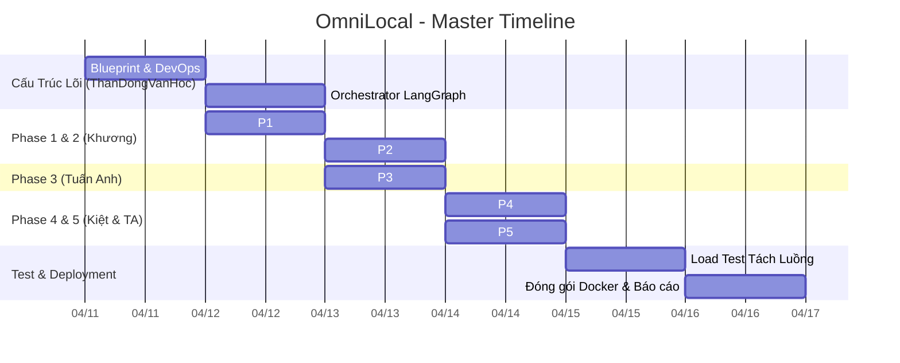

# OmniLocal – Project Timeline Report

> [!IMPORTANT]  
> **Report Status:** Sprint Timeline & Roadmap Allocation  
> **Prepared by:** Team APCS 24A01 (ThanDongVanHoc)  
> **Target Completion:** April 16, 2026

Dưới đây là sơ đồ Gantt Chart phản ánh trực tiếp tiến độ thực tế (Roadmap) mà team đang quản lý nghiêm ngặt trên hệ thống GitHub Projects. Sơ đồ này cho thấy sự gối đầu liên tục giữa các Sprints (Các luồng công việc).

## 📊 OmniLocal Sprints Roadmap

## 📋 Phân Lịch Chi Tiết
*   **11/04 - 12/04 | Base Architecture:** Hoàn thiện sơ đồ LangGraph đa luồng, cách ly môi trường qua bash automation, API webhook hai chiều đã chạy thông.
*   **12/04 - 14/04 | Core Data Processing:** Vận hành luồng bóc tách dữ liệu vật lý (P1) chạy thẳng qua máy dịch GenAI LLM (P2).
*   **13/04 - 15/04 | Filtering & Localization:** Kiểm duyệt các từ khóa nhạy cảm / độ dài bị tràn (P3), đè chữ lại lên format hình chuẩn (P4) và dùng tác tử Agent kiểm tra lần cuối (P5).
*   **15/04 - 16/04 | Integration & Polish:** Hợp nhất 5 endpoints, load testing liên hoàn, đóng gói container và tinh chỉnh tài liệu để Submit báo cáo.
